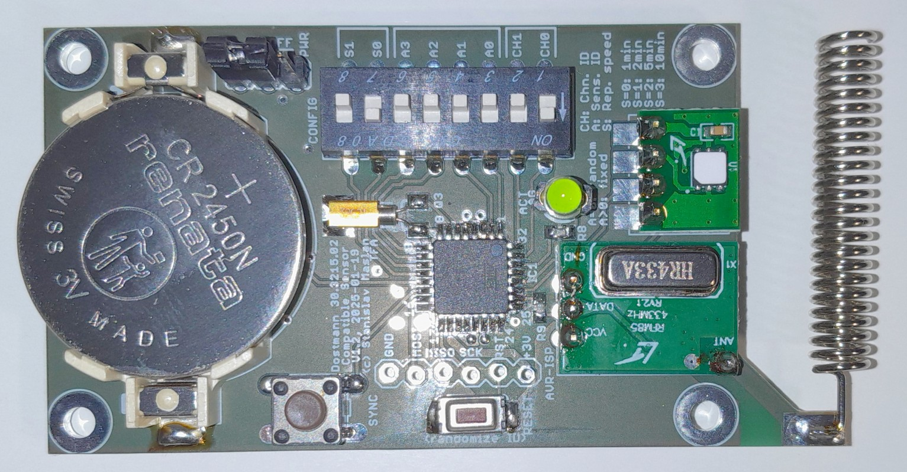
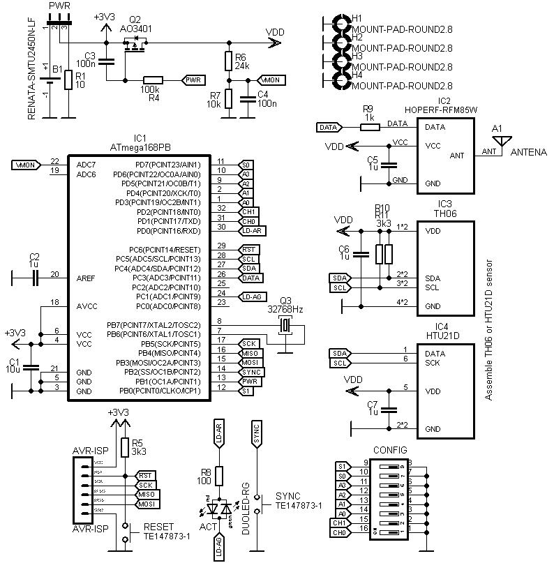
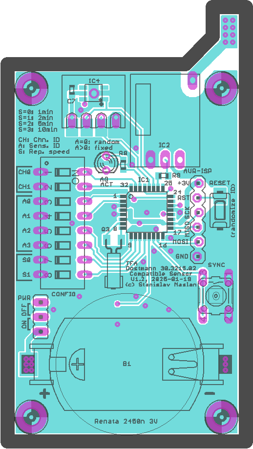
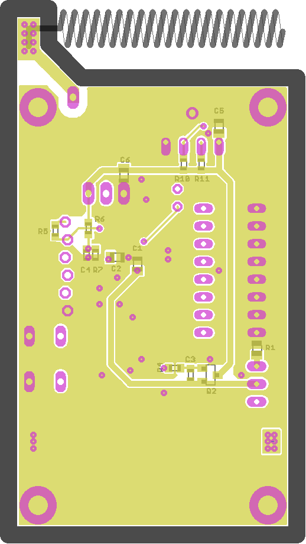

# TFA Dostmann 30.3215.02 compatible sensor

Recently, one of my meteo sensors TFA Dostmann 30.3215.02 died (rusted battery contacts). 
Not so long ago I decoded its data packets and made logging receiver for this particular type ([TFA-30321502-decoder](https://github.com/smaslan/TFA-30321502-decoder)). 
So, I decided to make a clone of this sensor based on the decoded format and it seems to work fine.



## Hardware

As usually, I used 8-bit AVR [ATmega48PB](https://www.microchip.com/en-us/product/atmega48pb).
Temperature and humidity sensor is [Hoperf TH06](https://www.hoperf.com/sensor/temperature_sensor/TH06.html).
Transmitter is cheap 433.92MHz module [Hoperf RFM85W-433](https://datasheet4u.com/datasheet-pdf/HOPERF/RFM85W-433D/pdf.php?id=748076) with AM modulation but it would work with any other module.
Both sensor and transmitter have switchable power to reduce idle consumption to near zero. Battery voltage sensing is also from the switched bus.
Intended power supply is from a single 3V cell Renata 2450n with approx. 500mAh capacity but it can of course run from 2xAAA cells or so.
Idle current is few uA and average charge consumed per single transmission is approx. 1uAh, so with 1 minute reporting period it should last about a year on the battery.
Configuration of the module is done by 8 DIP switches (see below).
Diagram and PCB in Eagle 6.5.0 are available at [TFA_sensor/](./TFA_sensor/) 





## AVR Firmware

Firmware for AVR is written in [Microchip Studio](https://www.microchip.com/en-us/tools-resources/develop/microchip-studio) using AVRGCC compiler. 
AVR main clock is internal RC at 1MHz which is more than enough. Timer 2 is configured to use external 32768Hz crystal to periodically wakeup AVR from power save mode for the auto reporting.
Reporting period can be set by DIP switches and it is randomized +-5% to prevent permanent overlap with other sensors. Reporting can be also forced by SYNC button same as with original sensors.
Pressing RESET or cycling power will regenerate random device ID code same as with original sensor. 
When SYNC button or periodic wakeup occures, it will enable power bus, read sensor data and start transmission in format described in 
[TFA-30321502-decoder](https://github.com/smaslan/TFA-30321502-decoder). Then goes sleep again. The whole cycle takes less than 1 second (transmission is slow).
Dual color LED will blink green if battery voltage is ok and red if not.

DIP switches configuration:
```
CH[1..0]: Channel code, values 0, 1 and 2 (equal to original sensor switch positions 1, 2, 3), 
          this FW allows codes up to 3 but it won't be recognized by original meteo base station!
A[3..0]:  Sensor ID code: 0 will generate random ID after power up or RESET,
                          1 to 15 will force A value as sensor ID.
S[1..0]:  Reporting period (0: 1min, 1: 2min, 2: 5min, 3: 10min).                             
```

AVR fuse bits are set to default:
```
 Extended byte: BOOTRST = 1, BOOTSZ[1..0] = 00 
 High byte: BODLEVEL = 111, EESAVE = 1, WDTON = 1, SPIEN = 0, DWEN = 1, RSTDISBL = 1
 Low byte: CKSEL[3..0] = 0010, SUT[1..0] = 10, CKOUT = 1, CKDIV8 = 0
```
Firmware is available at [TFA_sensor/fw_tfa_sensor/](./TFA_sensor/fw_tfa_sensor).

## License
All parts of the project are distributed under [MIT license](./LICENSE.txt).
